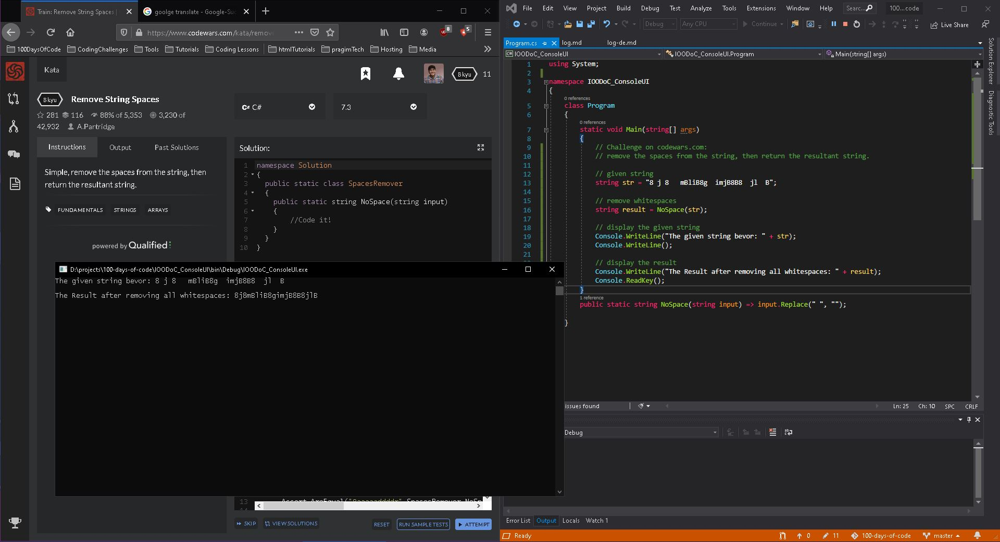

# #100DaysOfCode Log - Round 1 - Dominic Gerweck

## Day 49 - Round 1

#### January 26, 2020

## Today's Progress:

Today I finished the 'Product Landing Page' project @freeCodeCamp. Some layout fixes and the header needs a bit attention. I will work on the Layout later.

## Thoughts

Great day tomorrow. I have my last job interview before I must decide where to go and what to do next.

## Tutorials

- ### JavaScript Algorithms and Data Structures' Certification at [freeCodeCamp](https://www.freecodecamp.org/learn/javascript-algorithms-and-data-structures/basic-javascript/)

  Today I finished 1 lesson:

   - [x] Manipulating Complex Objects


## Daily Code Snippets

### JavaScript

#### Manipulating Complex Objects

Add a new album to the myMusic array. Add artist and title strings, release_year number, and a formats array of strings.

```javascript
var myMusic = [
  {
    "artist": "Billy Joel",
    "title": "Piano Man",
    "release_year": 1973,
    "formats": [
      "CD",
      "8T",
      "LP"
    ],
    "gold": true
  }
  // Add record here
];
```
Solution:
```javascript
var myMusic = [
  {
    "artist": "Billy Joel",
    "title": "Piano Man",
    "release_year": 1973,
    "formats": [
      "CD",
      "8T",
      "LP"
    ],
    "gold": true
  }, 

  // Add record here
  {
    "artist": "Dominic Gerweck",
    "title": "JavaScript tutorial",
    "release_year": 2020,
    "formats": [
      "HTML", "CSS", "JS"
    ]
  }
];

```

## Daily Images

Responsive Web Design Projects - Build a Product Landing Page

<p style="align:left"></p>
<p style="align:left"></p>

## Links to my work:

| [My GithubPage](https://doger83.github.io/PersonalPortfolio/) | [Personal Portfolio](https://github.com/doger83/PersonalPortfolio) | [Tribute Page](https://github.com/doger83/Tributepage) | [Survey Form](https://github.com/doger83/SurveyForm) | [Product Landing Page](https://github.com/doger83/ProductLandingPage) | [FlexBox Template](https://github.com/doger83/WebsiteTemplate) | [g2Asteroids](https://github.com/doger83/g2Asteroids) | [Quiz App](https://github.com/doger83/QuizApp) | [DoubleD's Website](https://github.com/doger83/DoubleD) |[TODO](todo.md) |

---

## Day 48 - Round 1

#### January 25, 2020

## Today's Progress:

 I needed a break today. My head is full of stuff that I need to process. So I did only one lesson @FreeCodecamp. Maybe I watch some tutorials at YouTube later.

## Tutorials

- ### JavaScript Algorithms and Data Structures' Certification at [freeCodeCamp](https://www.freecodecamp.org/learn/javascript-algorithms-and-data-structures/basic-javascript/)

  Today I finished 1 lesson:

   - [x] Testing Objects for Properties


## Daily Code Snippets

### JavaScript

#### Testing Objects for Properties

Modify the function *checkObj* to test *myObj* for *checkProp*. If the property is found, return that property's value. If not, return "Not Found".

```javascript
function checkObj(checkProp) {
  // Your Code Here

  return "Change Me!";
}
```
Solution:
```javascript
// Setup
function checkObj(checkProp) {
  // Your Code Here
  if (myObj.hasOwnProperty(checkProp)) {
    return myObj[checkProp];
  } 
  else {
    return "Not Found"
  }
}
```

## Daily Image

Basic JavaScript Tutorial "Testing Objects for Properties"

<p style="align:left"></p>

## Links to my work:

| [My GithubPage](https://doger83.github.io/PersonalPortfolio/) | [Personal Portfolio](https://github.com/doger83/PersonalPortfolio) | [Tribute Page](https://github.com/doger83/Tributepage) | [Survey Form](https://github.com/doger83/SurveyForm) | [Product Landing Page](https://github.com/doger83/ProductLandingPage) | [FlexBox Template](https://github.com/doger83/WebsiteTemplate) | [g2Asteroids](https://github.com/doger83/g2Asteroids) | [Quiz App](https://github.com/doger83/QuizApp) | [DoubleD's Website](https://github.com/doger83/DoubleD) |[TODO](todo.md) |

---

## Day 47 - Round 1

#### January 24, 2020

## Today's Progress:

Started this day with some lessons about objects in JavaScript [@freeCodeCamp](https://www.freecodecamp.org/learn). Than I started working on my "real-world" WebSite project. Soon I realized, my coding skills are not good enough to work as fast as I need/want to right now. That's why I first did some YT tutorials about getting Gatsby.js started and how to use it with bootstrap and bootstrap react. 

## Thoughts
Gatsby.js is very great, but I **need** to learn deeper and more about react components to get my work finished.
```
Learning WebDevelopment can be hard ...
But it still feels soooo amazing for me
```

## Projects

- ### "real-world" WebSite project
  TODO (Pivotaltracker storie):
  - [ ] make sure that all pages and components look OK on different size screens 

  WORK:
  - [ ] under progress ...
  - [ ] under progress ...


## Tutorials

- ### JavaScript Algorithms and Data Structures' Certification at [freeCodeCamp](https://www.freecodecamp.org/learn/javascript-algorithms-and-data-structures/basic-javascript/)

  Today I finished 8 lesson:

  - [x] Build JavaScript Objects
  - [x] Accessing Object Properties with Dot Notation
  - [x] Accessing Object Properties with Bracket Notation
  - [x] Accessing Object Properties with Variables
  - [x] Updating Object Properties
  - [x] Add New Properties to a JavaScript Object
  - [x] Delete Properties from a JavaScript Object
  - [x] Using Objects for Lookups  

- ### Gatsby - Full Tutorial for Beginners at [YouTube](https://www.youtube.com/watch?v=mHFAM0CXviE&t=710s) made by freeCodeCamp 

   In this tutorial I learned:

  - Introduction
  - Mac & Windows Installation
  - Creating a new site
  - Adding Content
  - Linking Pages
  - Interactive Pages
  - Building your site
  - Components
  - Plugins
  - Layouts
  - Site Data
  - File Data
  - Working with Markdown


- ### Gatsbyjs Bootstrap 4 + React Bootstrap + Custom CSS (TUTORIAL) at [YouTube](https://www.youtube.com/watch?v=fLCiSSu6-sI)

  In this tutorial I learned:

  - how to install bootstrap and react bootstrap 
  - add a navbar and a footer as components

## Daily Code Snippets

### JavaScript

#### Using Objects for Lookups

Convert the switch statement into an object called lookup. Use it to look up val and assign the associated string to the result variable.

```javascript
// Setup
function phoneticLookup(val) {
  var result = "";

  // Only change code below this line
  switch(val) {
    case "alpha":
      result = "Adams";
      break;
    case "bravo":
      result = "Boston";
      break;
    case "charlie":
      result = "Chicago";
      break;
    case "delta":
      result = "Denver";
      break;
    case "echo":
      result = "Easy";
      break;
    case "foxtrot":
      result = "Frank";
  }

  // Only change code above this line
  return result;
}
```
Solution:
```javascript
// Setup
function phoneticLookup(val) {
  var result = "";

  // Only change code below this line
  
  var lookup = {
    "alpha"   : "Adams",
    "bravo"   : "Boston",
    "charlie" : "Chicago",
    "delta"   : "Denver",
    "echo"    : "Easy",
    "foxtrot" : "Frank"
  };

  result = lookup[val];

  // Only change code above this line
  return result;
}

```

## Daily Image

Basic JavaScriptTutorial "Using Objects for Lookups"

<p style="align:left"></p>

## Links to my work:

| [My GithubPage](https://doger83.github.io/PersonalPortfolio/) | [Personal Portfolio](https://github.com/doger83/PersonalPortfolio) | [Tribute Page](https://github.com/doger83/Tributepage) | [Survey Form](https://github.com/doger83/SurveyForm) | [Product Landing Page](https://github.com/doger83/ProductLandingPage) | [FlexBox Template](https://github.com/doger83/WebsiteTemplate) | [g2Asteroids](https://github.com/doger83/g2Asteroids) | [Quiz App](https://github.com/doger83/QuizApp) | [DoubleD's Website](https://github.com/doger83/DoubleD) |[TODO](todo.md) |

---

## Day 46 - Round 1

#### January 23, 2020

## Today's Progress:

Today I had a job interview and was invited to stay for the rest of the day and do a short intership/trial work. It was very late but a great day.

Did a short lesson as usal [@freeCodeCamp](https://www.freecodecamp.org/learn).

## Tutorials

### JavaScript Algorithms and Data Structures' Certification at [freeCodeCamp](https://www.freecodecamp.org/learn/javascript-algorithms-and-data-structures/basic-javascript/counting-cards)

Today I finished 1 lesson:

- [x] Counting Cards

## Daily Codesnippets

### JavaScript

#### Counting Cards

In the casino game Blackjack, a player can gain an advantage over the house by keeping track of the relative number of high and low cards remaining in the deck. This is called Card Counting.

Having more high cards remaining in the deck favors the player. Each card is assigned a value according to the table below. When the count is positive, the player should bet high. When the count is zero or negative, the player should bet low.

  | Count Change   | Cards      |
  |----------------|------------|
  | +1 | 2, 3, 4, 5, 6          |
  | 0  | 7. 8. 9                |
  | -1 | 10, 'J', 'Q', 'K', 'A' |

You will write a card counting function. It will receive a card parameter, which can be a number or a string, and increment or decrement the global count variable according to the card's value (see table). The function will then return a string with the current count and the string Bet if the count is positive, or Hold if the count is zero or negative. The current count and the player's decision (Bet or Hold) should be separated by a single space.

Example Output
```
-3 Hold
5 Bet
```
- Do NOT reset count to 0 when value is 7, 8, or 9.
- Do NOT return an array.
- Do NOT include quotes (single or double) in the output.

```javascript
  function cc(card) {
    switch(card) {
      case 2:
      case 3:
      case 4:
      case 5:
      case 6:
        count++;
        break;
      case 10:
      case "J":
      case "Q":
      case "K":
      case "A":
        count--;
        break;
    }

    var holdbet = 'Hold'
    if (count > 0) {
      holdbet = 'Bet'
    }

    return count + " " + holdbet;
  }
```

## Daily Image

Basic JavaScriptTutorial "Counting CardsPassed"

<p style="align:left"></p>

## Links to my work:

| [My GithubPage](https://doger83.github.io/PersonalPortfolio/) | [Personal Portfolio](https://github.com/doger83/PersonalPortfolio) | [Tribute Page](https://github.com/doger83/Tributepage) | [Survey Form](https://github.com/doger83/SurveyForm) | [Product Landing Page](https://github.com/doger83/ProductLandingPage) | [FlexBox Template](https://github.com/doger83/WebsiteTemplate) | [g2Asteroids](https://github.com/doger83/g2Asteroids) | [Quiz App](https://github.com/doger83/QuizApp) | [DoubleD's Website](https://github.com/doger83/DoubleD) |[TODO](todo.md) |

---

## Day 45 - Round 1

#### January 22, 2020

## Today's Progress:

Next day having job interviews. I only learned a bit in the evening and started working on a new project for one hour (more reading and learning than coding). I had problems starting dev mode. But now it runs. Had great help!


## Tutorials

- ### JavaScript Algorithms and Data Structures' Certification at [freeCodeCamp](https://www.freecodecamp.org/learn/javascript-algorithms-and-data-structures/basic-javascript/chaining-if-else-statements)

  Today I finished 1 lesson:

  - [x] Return Early Pattern for Functions

## TODO

- [ ] finish the web cert projects! (under progress)

## Daily Codesnippets

- ### JavaScript

  #### Return Early Pattern for Functions

  When a return statement is reached, the execution of the current function stops and control returns to the calling location.

  Example

  ```javascript
  function myFun() {
   console.log("Hello");
   return "World";
   console.log("byebye")
   }
  myFun();
  ```

## Daily Image

Java Tutorial "Return Early Pattern for Functions"

<p style="align:left"></p>

## Links to my work:

| [My GithubPage](https://doger83.github.io/PersonalPortfolio/) | [Personal Portfolio](https://github.com/doger83/PersonalPortfolio) | [Tribute Page](https://github.com/doger83/Tributepage) | [Survey Form](https://github.com/doger83/SurveyForm) | [Product Landing Page](https://github.com/doger83/ProductLandingPage) | [FlexBox Template](https://github.com/doger83/WebsiteTemplate) | [g2Asteroids](https://github.com/doger83/g2Asteroids) | [Quiz App](https://github.com/doger83/QuizApp) | [DoubleD's Website](https://github.com/doger83/DoubleD) |[TODO](todo.md) |

---

## Day 44 - Round 1

#### January 21, 2020

## Today's Progress:

It was the first day having job interviews. I only learned a bit in the evening.

## Thoughts

Felt like having one meeting after the other, the whole day.

## Tutorials

- ### JavaScript Algorithms and Data Structures' Certification at [freeCodeCamp](https://www.freecodecamp.org/learn/javascript-algorithms-and-data-structures/basic-javascript/chaining-if-else-statements)

  Today I finished 1 lesson:

  - [x] Returning Boolean Values from Functions

## TODO

- [ ] finish the web cert projects! (under progress)

## Daily Codesnippets

- ### JavaScript

  Fix the function isEqual to remove the if/else statements.

  ```javascript
  function isEqual(a, b) {
    if (a === b) {
      return true;
    } else {
      return false;
    }
  }
  ```

  solution:

  ```javascript
  function isEqual(a, b) {
    return a === b;
  }
  ```

## Daily Image

Java Tutorial "Returning Boolean Values from Functions"

<p style="align:left"></p>

## Links to my work:

| [My GithubPage](https://doger83.github.io/PersonalPortfolio/) | [Personal Portfolio](https://github.com/doger83/PersonalPortfolio) | [Tribute Page](https://github.com/doger83/Tributepage) | [Survey Form](https://github.com/doger83/SurveyForm) | [Product Landing Page](https://github.com/doger83/ProductLandingPage) | [FlexBox Template](https://github.com/doger83/WebsiteTemplate) | [g2Asteroids](https://github.com/doger83/g2Asteroids) | [Quiz App](https://github.com/doger83/QuizApp) | [DoubleD's Website](https://github.com/doger83/DoubleD) |[TODO](todo.md) |

---

## Day 43 - Round 1

#### January 20, 2020

## Today's Progress:

I was very busy today. I looked at 3 training centers and came home very late. So I did only a view Tutorials @freeCodeCamp to keep the challenge running.

## Thoughts

The training centers are an option that I will keep in mind as an alternative.

## Tutorials

- ### JavaScript Algorithms and Data Structures' Certification at [freeCodeCamp](https://www.freecodecamp.org/learn/javascript-algorithms-and-data-structures/basic-javascript/chaining-if-else-statements)

  Today I finished 4 lessons:

  - [x] Replacing If Else Chains with Switch
  - [x] Multiple Identical Options in Switch Statements
  - [x] Adding a Default Option in Switch Statements
  - [x] Selecting from Many Options with Switch Statements

## TODO

- [ ] finish the web cert projects! (under progress)

## Daily Code Snippets

- ### JavaScript

  Replacing If Else Chains with Switch

  ``` javascript
  if (val === "bob") {
    answer = "Marley";
  } else if (val === 42) {
    answer = "The Answer";
  } else if (val === 1) {
    answer = "There is no #1";
  } else if (val === 99) {
    answer = "Missed me by this much!";
  } else if (val === 7) {
    answer = "Ate Nine";
  }
  ```

  ```javascript
  switch (val) {
    case "bob":
      answer = "Marley";
      break;
    case 42:
      answer = "The Answer";
      break;
    case 1:
      answer = "There is no #1";
      break;
    case 99:
      answer = "Missed me by this much!";
      break;
    case 7:
      answer = "Ate Nine";
      break;
  }
  ```

## Daily Image

Java Tutorial "Replacing If Else Chains with Switch"

<p style="align:left"></p>

## Links to my work:

| [My GithubPage](https://doger83.github.io/PersonalPortfolio/) | [Personal Portfolio](https://github.com/doger83/PersonalPortfolio) | [Tribute Page](https://github.com/doger83/Tributepage) | [Survey Form](https://github.com/doger83/SurveyForm) | [Product Landing Page](https://github.com/doger83/ProductLandingPage) | [FlexBox Template](https://github.com/doger83/WebsiteTemplate) | [g2Asteroids](https://github.com/doger83/g2Asteroids) | [Quiz App](https://github.com/doger83/QuizApp) | [DoubleD's Website](https://github.com/doger83/DoubleD) |[TODO](todo.md) |

---

## Day 42 - Round 1

#### January 19, 2020

## Today's Progress:

Today I got into learning **gatsbyjs**. There are lots of plugins to learn.

    I will dive in deeper tomorrow.

## Tutorials

- ### JavaScript Algorithms and Data Structures' Certification at [freeCodeCamp](https://www.freecodecamp.org/learn/javascript-algorithms-and-data-structures/basic-javascript/chaining-if-else-statements)

  Today I finished 1 lesson:

  - [x] Golf Code

## TODO

- [ ] finish the web cert projects! (under progress)

## Daily Codesnippets

- ### Java

  Gatsby's starter template "Hello World!"

  ```javascript
  import React from "react";
  export default () => <div>Hello world!</div>;
  ```

## Daily Image

Java Tutorial

<p style="align:left"></p>

## Links to my work:

| [My GithubPage](https://doger83.github.io/PersonalPortfolio/) | [Personal Portfolio](https://github.com/doger83/PersonalPortfolio) | [Tribute Page](https://github.com/doger83/Tributepage) | [Survey Form](https://github.com/doger83/SurveyForm) | [Product Landing Page](https://github.com/doger83/ProductLandingPage) | [FlexBox Template](https://github.com/doger83/WebsiteTemplate) | [g2Asteroids](https://github.com/doger83/g2Asteroids) | [Quiz App](https://github.com/doger83/QuizApp) | [DoubleD's Website](https://github.com/doger83/DoubleD) |[TODO](todo.md) |

---

## Day 41 - Round 1

#### January 18 2020

## Today's Progress:

I started learning more about **java** @SoloLearn today.

    The first basics felt verry similar to c# 🤔

## Tutorials

- ### Java Tutorial at [SoloLearn](https://www.sololearn.com/Course/Java/)

  - [x] Basic Concepts

- ### JavaScript Algorithms and Data Structures' Certification at [freeCodeCamp](https://www.freecodecamp.org/learn/javascript-algorithms-and-data-structures/basic-javascript/chaining-if-else-statements)

  Today I finished 2 lessons:

  - [x] Logical Order in If Else Statements
  - [x] Chaining If Else Statements

## TODO

- [ ] finish the web cert projects! (under progress)

## Daily Codesnippets

- ### Java

  Getting User input

  ```java
  import java.util.Scanner;

  class MyClass {
    public static void main(String[ ] args) {
      Scanner myVar = new Scanner(System.in);
      System.out.println(myVar.nextLine());
    }
  }
  ```

- ### JavaScript

  Chaining If Else Statements

  ```javascript
  if (condition1) {
    // statement1
  } else if (condition2) {
    // statement2
  } else if (condition3) {
    // statement3
  } else {
    // statementN
  }
  ```

## Daily Image

Java Tutorial

<p style="align:left"></p>

## Links to my work:

| [My GithubPage](https://doger83.github.io/PersonalPortfolio/) | [Personal Portfolio](https://github.com/doger83/PersonalPortfolio) | [Tribute Page](https://github.com/doger83/Tributepage) | [Survey Form](https://github.com/doger83/SurveyForm) | [Product Landing Page](https://github.com/doger83/ProductLandingPage) | [FlexBox Template](https://github.com/doger83/WebsiteTemplate) | [g2Asteroids](https://github.com/doger83/g2Asteroids) | [Quiz App](https://github.com/doger83/QuizApp) | [DoubleD's Website](https://github.com/doger83/DoubleD) |[TODO](todo.md) |

---

## Day 40 - Round 1

#### January 17, 2020

## Today's Progress:

Yesterday was a long night @Udemy. I did two more courses.

    Now off to Bremen. Take a look at WBS Trainings
    to be continued..

## Tutorials

- ### Learn Basic CSS at [UDEMY](https://www.udemy.com/share/101NkVCUIYdFZSQns=/)

  - [x] completed the course (see Images)

- ### Learn HTML From SCRATCH at [UDEMY](https://www.udemy.com/share/102uZaCUIYdFZSQns=/)

  - [x] completed the course (see Images)

- ### JavaScript Algorithms and Data Structures' Certification at [freeCodeCamp](https://www.freecodecamp.org/learn)

  Today I finished 1 lesson:

  - [x] Introducing Else If Statements

## TODO

- [ ] finish the web cert projects! (under progress)

## Daily Image

CSS and HTML courses at Udemy

<p align="left">  
  
  
</p>

## Links to my work:

| [My GithubPage](https://doger83.github.io/PersonalPortfolio/) | [Personal Portfolio](https://github.com/doger83/PersonalPortfolio) | [Tribute Page](https://github.com/doger83/Tributepage) | [Survey Form](https://github.com/doger83/SurveyForm) | [FlexBox Template](https://github.com/doger83/WebsiteTemplate) | [g2Asteroids](https://github.com/doger83/g2Asteroids) | [Quiz App](https://github.com/doger83/QuizApp) | [DoubleD's Website](https://github.com/doger83/DoubleD) |[TODO](todo.md) |

---

## Day 39 - Round 1

#### January 16, 2020

## Today's Progress:

Today I solved a problem named "Popsicles" @SoloLearn. Did my daily tutorial @freeCodeCamp.

I Finished this day with a little jQuery course @Udemy. It covers the basics for beginner.

## Tutorials

- ### JavaScript Algorithms and Data Structures' Certification at [freeCodeCamp](https://www.freecodecamp.org/learn)

  Today I finished 1 lesson:

  - [x] Introducing Else Statements

- ### Learn Basic JQuery at [UDEMY](https://www.udemy.com/share/101T9ICUIYdFZSQns=/)
  - [x] completed the course (see Images)

## Coding Challenges

### CodeCoach at [SoloLearn](https://www.sololearn.com/)

- ### Challenge: Popsicles

  You have a box of popsicles and you want to give them all away to a group of brothers and sisters. If you have enough left in the box to give them each an even amount you should go for it! If not, they will fight over them, and you should eat them yourself later.

  #### Task

  Given the number of siblings that you are giving popsicles to, determine if you can give them each an even amount or if you shouldn't mention the popsicles at all.

  #### Input Format

  Two integer values, the first one represents the number of siblings, and the second one represents the number of popsicles that you have left in the box.

  #### Output Format

  A string that says 'give away' if you are giving them away, or 'eat them yourself' if you will be eating them yourself.

  #### Sample Input

  3 9

  #### Sample Output

  give away

  ## My Solution

  ```csharp
  if ((popsicles % siblings) == 0)
  {
    Console.WriteLine("give away");
  }
  else
  {
    Console.WriteLine("eat them yourself");
  }
  ```

## TODO

- [ ] finish the web cert projects! (under progress)

## Daily Image

JQuery course at Udemy

<p align="left">  
  
  
</p>

## Links to my work:

| [My GithubPage](https://doger83.github.io/PersonalPortfolio/) | [Personal Portfolio](https://github.com/doger83/PersonalPortfolio) | [Tribute Page](https://github.com/doger83/Tributepage) | [Survey Form](https://github.com/doger83/SurveyForm) | [FlexBox Template](https://github.com/doger83/WebsiteTemplate) | [g2Asteroids](https://github.com/doger83/g2Asteroids) | [Quiz App](https://github.com/doger83/QuizApp) | [DoubleD's Website](https://github.com/doger83/DoubleD) |[TODO](todo.md) |

---

## Day 38 - Round 1

#### January 15, 2020

## Today's Progress:

Finished my SurveyForm project @freeCodeCamp. It passed all tests @CodePen.

    Now I'm working on the LandingPage project..

## Projects

- ### Survey Form Page

  - final version
  - passed all tests

- ### Product Landing Page

  - project start
  - setup workflow
  - installed packages
  - added Navbar

It passes 7 of 16 tests.

## Tutorials

- ### JavaScript Algorithms and Data Structures' Certification at [freeCodeCamp](https://www.freecodecamp.org/learn)

  Today I finished 5 lessons:

  - [x] Comparisons with the Logical Or Operator
  - [x] Comparisons with the Logical And Operator
  - [x] Comparison with the Less Than Or Equal To Operator
  - [x] Comparison with the Less Than Operator
  - [x] Comparison with the Greater Than Or Equal To Operator

## TODO

- [ ] finish the web cert projects! (under progress)

## Daily Image

<p align="left">  
  
  
</p>

## Links to my work:

| [My GithubPage](https://doger83.github.io/PersonalPortfolio/) | [Personal Portfolio](https://github.com/doger83/PersonalPortfolio) | [Tribute Page](https://github.com/doger83/Tributepage) | [Survey Form](https://github.com/doger83/SurveyForm) | [FlexBox Template](https://github.com/doger83/WebsiteTemplate) | [g2Asteroids](https://github.com/doger83/g2Asteroids) | [Quiz App](https://github.com/doger83/QuizApp) | [DoubleD's Website](https://github.com/doger83/DoubleD) |[TODO](todo.md) |

---

## Day 37 - Round 1

#### January 14, 2020

## Today's Progress:

Today was a short hour. Just added bootstrap4 jQuery popper.js to my freeCodeCamp SurveyForm project. Mostly tutorials.

    I will style it tomorrow.

## Projects

- ### Survey Form Page

  - installed bootstrap, jquery and popper.js
  - addded "some" style

## Tutorials

- ### JavaScript Algorithms and Data Structures' Certification at [freeCodeCamp](https://www.freecodecamp.org/learn)

  Today I finished 3 lessons:

  - [x] Comparison with the Inequality Operator
  - [x] Comparison with the Strict Inequality Operator
  - [x] Comparison with the Greater Than Operator

## TODO

- [ ] finish the web cert projects! (under progress)

## Daily Image

<p align="left">  
  
  
</p>

## Links to my work:

| [My GithubPage](https://doger83.github.io/PersonalPortfolio/) | [Personal Portfolio](https://github.com/doger83/PersonalPortfolio) | [Tribute Page](https://github.com/doger83/Tributepage) | [Survey Form](https://github.com/doger83/SurveyForm) | [FlexBox Template](https://github.com/doger83/WebsiteTemplate) | [g2Asteroids](https://github.com/doger83/g2Asteroids) | [Quiz App](https://github.com/doger83/QuizApp) | [DoubleD's Website](https://github.com/doger83/DoubleD) |[TODO](todo.md) |

---

## Day 36 - Round 1

#### January 13, 2020

## Today's Progress:

I got the approval for a full paid retraining from my job agency today. 🤗

    I just sent 10 emails to get job interviews.

## Projects

Today was MY "lazyday". I did only a view katas on codewars to keep my c# skills in mind.

```csharp
public static string TranslateWord (string word)
  {
    char[] phraseAsChars = word.ToCharArray();
    int animalIndex = word.IndexOf("fox");
    if (animalIndex != -1)
      {
        phraseAsChars[animalIndex++] = 'c';
        phraseAsChars[animalIndex++] = 'a';
        phraseAsChars[animalIndex] = 't';
      }
      string updatedPhrase = new string(phraseAsChars);
      return updatedPhrase;
  }
```

## Tutorials

- ### JavaScript Algorithms and Data Structures' Certification at [freeCodeCamp](https://www.freecodecamp.org/learn)

  Today I finished 5 lessons:

  - [x] Understanding Boolean Values
  - [x] Use Conditional Logic with If Statements
  - [x] Comparison with the Equality Operator
  - [x] Comparison with the Strict Equality Operator
  - [x] Practice comparing different values

## TODO

- [ ] finish the web cert projects! (under progress)

## Daily Image

KATA on codewars.com

<p align="left">  
  
  
</p>

## Links to my work:

| [My GithubPage](https://doger83.github.io/PersonalPortfolio/) | [Personal Portfolio](https://github.com/doger83/PersonalPortfolio) | [Tribute Page](https://github.com/doger83/Tributepage) | [Survey Form](https://github.com/doger83/SurveyForm) | [FlexBox Template](https://github.com/doger83/WebsiteTemplate) | [g2Asteroids](https://github.com/doger83/g2Asteroids) | [Quiz App](https://github.com/doger83/QuizApp) | [DoubleD's Website](https://github.com/doger83/DoubleD) |[TODO](todo.md) |

---

## Day 35 - Round 1

#### January 12, 2020

## Today's Progress:

Today I learned more about GULP. Had some problems with it, but I got it runing.

    I could get used to it.
    🤔

## Projects

- ### DoubleD's Artist Website

  - GULP is now runing

## Tutorials

- ### JavaScript Algorithms and Data Structures' Certification at [freeCodeCamp](https://www.freecodecamp.org/learn)

  Today I finished only 1 lesson:

  - [x] Stand in Line

## TODO

- [ ] finish the web cert projects! (under progress)

## Daily Image

GULP runing.

<p align="left">  
  
  
</p>

## Links to my work:

| [My GithubPage](https://doger83.github.io/PersonalPortfolio/) | [Personal Portfolio](https://github.com/doger83/PersonalPortfolio) | [Tribute Page](https://github.com/doger83/Tributepage) | [Survey Form](https://github.com/doger83/SurveyForm) | [FlexBox Template](https://github.com/doger83/WebsiteTemplate) | [g2Asteroids](https://github.com/doger83/g2Asteroids) | [Quiz App](https://github.com/doger83/QuizApp) | [DoubleD's Website](https://github.com/doger83/DoubleD) |[TODO](todo.md) |

---

## Day 34 - Round 1

#### January 11, 2020

## Today's Progress:

Today I added bootstrap and gulp to DoubleD project. But it did't run. I had an error.

    I need to learn more about bootstrap and gulp

That's why I watched and read a lot today about these two topics.

## Projects

- ### DoubleD's Artist Website

  - added bootstrap, jquery and popper.js
  - added gulp, gulp-sass and browser-sync

  had errors. gulp didn't run.

## Tutorials

- ### JavaScript Algorithms and Data Structures' Certification at [freeCodeCamp](https://www.freecodecamp.org/learn)

  Today I finished only 2 lessons:

  - [x] Understanding Undefined Value returned from a Function
  - [x] Assignment with a Returned Value

## TODO

- [ ] finish the web cert projects! (under progress)

## Daily Image

My full Resume.pdf

<p align="left">  
  
  
</p>

## Links to my work:

| [My GithubPage](https://doger83.github.io/PersonalPortfolio/) | [Personal Portfolio](https://github.com/doger83/PersonalPortfolio) | [Tribute Page](https://github.com/doger83/Tributepage) | [Survey Form](https://github.com/doger83/SurveyForm) | [FlexBox Template](https://github.com/doger83/WebsiteTemplate) | [g2Asteroids](https://github.com/doger83/g2Asteroids) | [Quiz App](https://github.com/doger83/QuizApp) | [DoubleD's Website](https://github.com/doger83/DoubleD) |[TODO](todo.md) |

---

## Day 33 - Round 1

#### January 10, 2020

## Today's Progress:

Today I finished my full-resume files. Now you can download it (pdf) on my portfolio page. Also you can downlad a contact-card file (vcf). At least I updated my Log.

    Hope you will like it.

## Projects

- ### My Personal Portfolio Page

  - centered the page Layout
  - deployed the vinal Version to https://www.dominic-gerweck.de

## Tutorials

- ### JavaScript Algorithms and Data Structures' Certification at [freeCodeCamp](https://www.freecodecamp.org/learn)

  Today I finished only 1 lessons:

  - [x] Return a Value from a Function with Return

## TODO

- [ ] finish the web cert projects! (under progress)

## Daily Image

My full Resume.pdf

<p align="left">  
  
  
</p>

## Links to my work:

| [My GithubPage](https://doger83.github.io/PersonalPortfolio/) | [Personal Portfolio](https://github.com/doger83/PersonalPortfolio) | [Tribute Page](https://github.com/doger83/Tributepage) | [Survey Form](https://github.com/doger83/SurveyForm) | [FlexBox Template](https://github.com/doger83/WebsiteTemplate) | [g2Asteroids](https://github.com/doger83/g2Asteroids) | [Quiz App](https://github.com/doger83/QuizApp) | [DoubleD's Website](https://github.com/doger83/DoubleD) |[TODO](todo.md) |

---

## Day 32 - Round 1

#### January 09, 2020

## Today's Progress:

Started a new project. Named it DoubleD's Website.
Deployed in on www.doger83.github.io/DoubleD/ .

    This time I will use #Bootstrap

## Projects

- ### DoubleD' Artists Website

  - initial Workflow setup
  - created Logo - deployed it on gitHub pages
  - more coming soon..

## Tutorials

- ### JavaScript Algorithms and Data Structures' Certification at [freeCodeCamp](https://www.freecodecamp.org/learn)

  Today I finished only 1 lessons:

  - [x] Global vs. Local Scope in Functions

## TODO

- [ ] finish the web cert projects! (under progress)

## Daily Image

DoubleD's Website Logo

<p align="left">  
  
  
</p>

## Links to my work:

| [My GithubPage](https://doger83.github.io/PersonalPortfolio/) | [Personal Portfolio](https://github.com/doger83/PersonalPortfolio) | [Tribute Page](https://github.com/doger83/Tributepage) | [Survey Form](https://github.com/doger83/SurveyForm) | [FlexBox Template](https://github.com/doger83/WebsiteTemplate) | [g2Asteroids](https://github.com/doger83/g2Asteroids) | [Quiz App](https://github.com/doger83/QuizApp) | [DoubleD's Website](https://github.com/doger83/DoubleD) |[TODO](todo.md) |

---

## Day 31 - Round 1

#### January 08, 2020

## Today's Progress:

Today I continued to work on my web projects and did some tutorials. I learned the basics about webpack.

    But I think I didn't got the whole thing.
    Had a lot of errors today 😅

## Thoughts

Need to learn more about bundling files with webpack.

## Tutorials

- ### JavaScript Algorithms and Data Structures' Certification at [freeCodeCamp](https://www.freecodecamp.org/learn)

  Today I finished only 1 lessons:

  - [x] Local Scope and Functions

## TODO

- [ ] finish the web cert projects! (under progress)

## Daily Image

<p align="center">  
  
</p>

## Links to my work:

| [My GithubPage](https://doger83.github.io/PersonalPortfolio/) | [Personal Portfolio](https://github.com/doger83/PersonalPortfolio) | [Tribute Page](https://github.com/doger83/Tributepage) | [Survey Form](https://github.com/doger83/SurveyForm) | [FlexBox Template](https://github.com/doger83/WebsiteTemplate) | [g2Asteroids](https://github.com/doger83/g2Asteroids) | [Quiz App](https://github.com/doger83/QuizApp) | [TODO](todo.md) |

---

## Day 30 - Round 1

#### January 07, 2020

## Today's Progress:

First I updated my Log. Then I cleaned up my repos on GitHub. I moved every project to a single repo. Not much coding.

## Tutorials

- ### JavaScript Algorithms and Data Structures' Certification at [freeCodeCamp](https://www.freecodecamp.org/learn)

  Today I finished only 1 lessons:

  - [x] Global Scope and Functions

## TODO

One less, there were now one left.

- [x] update my log! (finished)
- [ ] finish the web cert projects! (under progress)

## Daily Image

<p align="center">  
  
</p>

## Links to my work:

| [My GithubPage](https://doger83.github.io/PersonalPortfolio/) | [Personal Portfolio](https://github.com/doger83/PersonalPortfolio) | [Tribute Page](https://github.com/doger83/Tributepage) | [Survey Form](https://github.com/doger83/SurveyForm) | [FlexBox Template](https://github.com/doger83/WebsiteTemplate) | [g2Asteroids](https://github.com/doger83/g2Asteroids) | [Quiz App](https://github.com/doger83/QuizApp) | [TODO](todo.md) |

---

## Day 29 - Round 1

#### January 06, 2020

## Today's Progress:

Had an appointment with the dentist. Worked only one hour on my g2Asteroid project and a little bit on my portfolio to fix spelling mistakes and stuff like that.

## Projects

- ### Personal Portfolio Web Page

  - fixed spelling mistakes
  - changed headings style

## Tutorials

- ### JavaScript Algorithms and Data Structures' Certification at [freeCodeCamp](https://www.freecodecamp.org/learn)

  Today I finished only 1 lessons:

  - [x] Passing Values to Functions with Arguments

## TODO

- [ ] update my log! (under progress)
- [ ] finish the web cert projects! (under progress)

## Daily Image

<p align="center">  
  
</p>

## Links to work:

| [FlexBox Template](https://github.com/doger83/WebsiteTemplate) | [GithubPage](https://doger83.github.io/PersonalPortfolio/) | [g2Asteroids](https://github.com/doger83/g2Asteroids) | [Quiz App](/Projects/QuizAApp) | [TODO](todo.md) | [Tribute Page](/Projects/WebDevCert/TributePage/Index.html) | [Survey Form](/Projects/WebDevCert/SurveyForm) | [Personal Portfolio](https://www.dominic-gerweck.de) |

---

## Day 28 - Round 1

#### January 05, 2020

## Today's Progress:

A little late, but the final version of my portfolio is online !!!

Find it on [here](https://www.dominic-gerweck.de).

Only 4 weeks after starting this challange, my web-development skills have grown so much.

This feel so amazing. I want to thank [@ka11away](https://twitter.com/ka11away) and [@freeCodeCamp](https://twitter.com/freeCodeCamp).

🙏

## Projects

- ### Personal Portfolio Web Page

  - deployed final version v1.0

## Tutorials

- ### JavaScript Algorithms and Data Structures' Certification at [freeCodeCamp](https://www.freecodecamp.org/learn)

  Today I finished only 1 lessons:

  - [x] Write Reusable JavaScript with Functions

## TODO

One less, there were now two.

- [x] get my portfolio online!
- [ ] update my log! (under progress)
- [ ] finish the web cert projects! (under progress)

## Daily Image

<p align="center">  
  
</p>

## Links to work:

| [FlexBox Template](https://github.com/doger83/WebsiteTemplate) | [GithubPage](https://doger83.github.io/PersonalPortfolio/) | [g2Asteroids](https://github.com/doger83/g2Asteroids) | [Quiz App](/Projects/QuizAApp) | [TODO](todo.md) | [Tribute Page](/Projects/WebDevCert/TributePage/Index.html) | [Survey Form](/Projects/WebDevCert/SurveyForm) | [Personal Portfolio](/Projects/WebDevCert/PersonalPortfolio/index.html) |

---

## Day 27 - Round 1

#### January 04, 2020

## Today's Progress:

Today I (tried) to make my portfolio responsive. It felt like styling every 'tag' a thousend times. 🤯

## Projects

- ### Personal Portfolio Web Page

  - added resume, portfolio and contact section
  - finished basic layout, some mediaqueries left

## Tutorials

- ### JavaScript Algorithms and Data Structures' Certification at [freeCodeCamp](https://www.freecodecamp.org/learn)

  Today I finished only 1 lessons:

  - [x] Shopping List

## TODO

- [ ] update my log! (under progress)
- [ ] finish the web cert projects! (under progress)
- [ ] get my portfolio online! (under progress)

## Daily Image

<p align="center">  
  
</p>

## Links to work:

| [FlexBox Template](https://github.com/doger83/WebsiteTemplate) | [GithubPage](https://doger83.github.io/PersonalPortfolio/) | [g2Asteroids](https://github.com/doger83/g2Asteroids) | [Quiz App](/Projects/QuizAApp) | [TODO](todo.md) | [Tribute Page](/Projects/WebDevCert/TributePage/Index.html) | [Survey Form](/Projects/WebDevCert/SurveyForm) | [Personal Portfolio](/Projects/WebDevCert/PersonalPortfolio/index.html) |

---

## Day 26 - Round 1

#### January 3rd, 2020

## Today's Progress:

I had a run. Total new layout for my portfolio page 😊.

## Projects

- ### Personal Portfolio Web Page

  - new background image for home screen
  - new background image for about screen
  - complete new layout for all pages

## Tutorials

- ### JavaScript Algorithms and Data Structures' Certification at [freeCodeCamp](https://www.freecodecamp.org/learn)

  Today I finished only 1 lessons:

  - [x] Manipulate Arrays With unshift()

## TODO

- [ ] update my log! (under progress)
- [ ] finish the web cert projects! (under progress)
- [ ] get my portfolio online! (under progress)

## Daily Image

<p align="center">  
  
</p>

## Links to work:

| [FlexBox Template](https://github.com/doger83/WebsiteTemplate) | [GithubPage](https://doger83.github.io/PersonalPortfolio/) | [g2Asteroids](https://github.com/doger83/g2Asteroids) | [Quiz App](/Projects/QuizAApp) | [TODO](todo.md) | [Tribute Page](/Projects/WebDevCert/TributePage/Index.html) | [Survey Form](/Projects/WebDevCert/SurveyForm) | [Personal Portfolio](/Projects/WebDevCert/PersonalPortfolio/index.html) |

---

## Day 25 - Round 1

#### January 2nd, 2020

## Today's Progress:

Today I decided to create my own WebsiteTemplate.

Find it [here](https://github.com/doger83/WebsiteTemplate).

## Projects

- ### My Flexbox Template

  - Added Flexbox template project. Used the w3Schools Flexbox template.

## Tutorials

- ### JavaScript Algorithms and Data Structures' Certification at [freeCodeCamp](https://www.freecodecamp.org/learn)

  Today I finished only 1 lessons:

  - [x] Manipulate Arrays With shift()

## TODO

- [ ] update my log! (under progress)
- [ ] finish the web cert projects! (under progress)
- [ ] get my portfolio online! (under progress)

## Daily Image

<p align="center">  
  
</p>

## Links to work:

| [FlexBox Template](https://github.com/doger83/WebsiteTemplate) | [GithubPage](https://doger83.github.io/PersonalPortfolio/) | [g2Asteroids](https://github.com/doger83/g2Asteroids) | [Quiz App](/Projects/QuizAApp) | [TODO](todo.md) | [Tribute Page](/Projects/WebDevCert/TributePage/Index.html) | [Survey Form](/Projects/WebDevCert/SurveyForm) | [Personal Portfolio](/Projects/WebDevCert/PersonalPortfolio/index.html) |

---

## Day 24 - Round 1

#### January 1st, 2020

Happ New Year it is 2️⃣0️⃣2️⃣0️⃣ NOW. I think this is the future!

## Today's Progress:

Today I worked on my personal portfolio web page.

## Projects

- ### Personal Portfolio Web Page
  - just added some movement

It's 5:35am and I'm still not finished, BUT 🤗 scratch is deployed on my [GithubPages](https://doger83.github.io/PersonalPortfolio/).

## Tutorials

- ### JavaScript Algorithms and Data Structures' Certification at [freeCodeCamp](https://www.freecodecamp.org/learn)

  Today I finished only 1 lessons:

  - [x] Manipulate Arrays With pop()

## TODO

- [ ] update my log! (under progress)
- [ ] finish the web cert projects! (under progress)
- [ ] get my portfolio online! (under progress)

## Daily Image

<p align="center">  
  
</p>

## Links to work:

| [GithubPage](https://doger83.github.io/PersonalPortfolio/) | [g2Asteroids](https://github.com/doger83/g2Asteroids) | [Quiz App](/Projects/QuizAApp) | [TODO](todo.md) | [Tribute Page](/Projects/WebDevCert/TributePage/Index.html) | [Survey Form](/Projects/WebDevCert/SurveyForm) | [Personal Portfolio](/Projects/WebDevCert/PersonalPortfolio/index.html) |

---

## Day 23 - Round 1

#### December 31, 2019

## Today's Progress:

Today I learned how to install SASS, running it with VScode on LiveServer, and how to get started with Ruby and NodeJS.

## Tutorials

- ### JavaScript Algorithms and Data Structures' Certification at [freeCodeCamp](https://www.freecodecamp.org/learn)

  Today I finished only 1 lessons:

  - [x] Manipulate Arrays With push()

- ### online Tutorials at YouTube

  - [x] "How to Install SASS on Windows and How to Get Started" [by Alex](https://www.youtube.com/watch?v=PJP-CR-9YM4&feature=youtu.be)
  - [x] "Responsive Portfolio Website [1] - Intro & Sass Workflow Setup" [by Traversy Media](https://www.youtube.com/watch?v=gYzHS-n2gqU)

## TODO (2019)

- [ ] update my log!
- [ ] finish the web cert projects!
- [ ] get my portfolio online!

## Daily Image

<p align="center">  
  
</p>

## Links to work:

| [g2Asteroids](https://github.com/doger83/g2Asteroids) | [Quiz App](/Projects/QuizAApp) | [TODO](todo.md) | [Tribute Page](/Projects/WebDevCert/TributePage/Index.html) | [Survey Form](/Projects/WebDevCert/SurveyForm) | [Personal Portfolio](/Projects/WebDevCert/PersonalPortfolio/index.html) |

---

## Day 22 - Round 1

#### December 30, 2019

## Today's Progress:

Lost tracking. Didn't code much the last two days.. Only some tutorials.
😥

## Tutorials

- ### JavaScript Algorithms and Data Structures' Certification at [freeCodeCamp](https://www.freecodecamp.org/learn)

  Today I finished 2 lessons:

  - [x] Modify Array Data With Indexes
  - [x] Access Multi-Dimensional Arrays With Indexes

- ### jQuery Tutorial at [SoloLearn](https://www.sololearn.com/Course/jQuery/)
  I finished all lessons with a little [Certification](https://www.sololearn.com/Certificate/1082-16696645/pdf/) at the end.

## TODO (2019)

- [ ] update my log!
- [ ] finish the web cert projects!
- [ ] get my portfolio online!

## Daily Image

<p align="center">  
  
</p>

## Links to work:

| [g2Asteroids](https://github.com/doger83/g2Asteroids) | [Quiz App](/Projects/QuizAApp) | [TODO](todo.md) | [Tribute Page](/Projects/WebDevCert/TributePage/Index.html) | [Survey Form](/Projects/WebDevCert/SurveyForm) | [Personal Portfolio](/Projects/WebDevCert/PersonalPortfolio/index.html) |

---

## Day 21 - Round 1

#### December 29, 2019

## Today's Progress:

Today I added "[g2Asteroids](https://github.com/doger83/g2Asteroids)" WPF-Application to my projects.

    This is a little game I started
    developing during my first c# lessons.

## Tutorials

Do at least on lesson a day!

- ### JavaScript Algorithms and Data Structures' Certification at [freeCodeCamp](https://www.freecodecamp.org/learn)
  Today I finished 1 lessons:
  - [x] Access Array Data with Indexes

## Projects

- ### g2Asteroid (WPF App)
  - [x] initialize g2Asteroids WPF game
  - [x] updated solution
  - [x] updated libraries

## Daily Image

<p align="center">  
  
</p>

## Links to work:

| [g2Asteroids](https://github.com/doger83/g2Asteroids) | [Quiz App](/Projects/QuizAApp) | [TODO](todo.md) | [Tribute Page](/Projects/WebDevCert/TributePage/Index.html) | [Survey Form](/Projects/WebDevCert/SurveyForm) | [Personal Portfolio](/Projects/WebDevCert/PersonalPortfolio/index.html) |

---

## Day 20 - Round 1

#### December 28, 2019

## Today's Progress:

Today I started with 3 JavaScript lessons at freeCodeCamp.org. Than I spent 3 hours doing the CSS tutorials again and work on my SurveyForm project.

    Learned how to add images in a .md file.

Find daily images now down below in the "Daily Image" sections.

## Tutorials

Do at least on lesson a day!

- ### JavaScript Algorithms and Data Structures' Certification at [freeCodeCamp](https://www.freecodecamp.org/learn)
  Today I finished 3 lessons:
  - [x] Word Blanks
  - [x] Store Multiple Values in one Variable using JavaScript Arrays
  - [x] Nest one Array within Another Array

## Projects

- ### Tribute Page
  - [x] added color theme
  - [x] added .gitignore
  - [x] updated libraries

## Daily Image

<p align="center">  
  
</p>

## Links to work:

| [Quiz App](/Projects/QuizAApp) | [TODO](todo.md) | [Tribute Page](/Projects/WebDevCert/TributePage/Index.html) | [Survey Form](/Projects/WebDevCert/SurveyForm) | [Personal Portfolio](/Projects/WebDevCert/PersonalPortfolio/index.html) |

---

## Day 19 - Round 1

#### December 27, 2019

## Today's Progress:

Today I had to work on my Tribute Page, cause it does NOT pass all tests.

**Now it does!**

## Tutorials

- ### JavaScript Algorithms and Data Structures' Certification at [freeCodeCamp](https://www.freecodecamp.org/learn)

  Did some of the basic lessons.

- ### My Courses at [SoloLearn](https://www.sololearn.com)
  Did some of the first lessons.

## Projects

- ### Tribute Page
  Now passing all the tests.

## TODO

- [ ] finish all of the 5 projects till 31.12.2019 !
- [ ] make the pages MORE responsive.

## Links to work:

| [Quiz App](/Projects/QuizAApp) | [TODO](todo.md) | [Tribute Page](/Projects/WebDevCert/TributePage/Index.html) | [Survey Form](/Projects/WebDevCert/SurveyForm) | [Personal Portfolio](/Projects/WebDevCert/PersonalPortfolio/index.html) |

---

## Day 18 - Round 1

#### December 26, 2019

## Today's Progress:

Today I started doing some of the Basic JavaScript lessons on www.freeCodeCamp.org. Later I created a first pure sceleton page for the Survey Form project. Then I updated my Log and finished the day with some lessons of the jQuery tutorial at www.soloLearn.com.

## Tutorials

- ### Responsive Web Design Certification at [freeCodeCamp](https://www.freecodecamp.org/learn)

  - finished ALL tutorials

        	TODO: fnish all of the 5 projects till 31.12.2019 !

- ### JavaScript Algorithms and Data Structures' Certification at [freeCodeCamp](https://www.freecodecamp.org/learn)

  - Finished some of the basic lessons.

- ### My Courses at [SoloLearn](https://www.sololearn.com)

  - Started the jQuery Tutorial and did some of the first lessons.

- ### Build a Quiz App with HTML, CSS, and JavaScript at [UDEMY](https://www.udemy.com)
  - Finished the first lesson.

## Projects

- ### Survey Form

  - Finished the pure sceleton page. Didn't pass all the Tests.

        TODO: Pass all the Tests!

## Links to work:

| [Quiz App](/Projects/QuizAApp) | [TODO](todo.md) | [Tribute Page](/Projects/WebDevCert/TributePage/Index.html) | [Survey Form](/Projects/WebDevCert/SurveyForm) | [Personal Portfolio](/Projects/WebDevCert/PersonalPortfolio/index.html) |

---

## Day 17 - Round 1

#### December 25, 2019

## Today's Progress:

Started two free HTML, CSS, JavaScript courses @ www.udemy.com wich I found [@Udemy_Coupons1](https://twitter.com/Udemy_Coupons1). The first was created by [Anjali Singh](https://www.udemy.com/user/1dd78b63-73f9-40e4-b3d5-f5b49059d703/) the second by [@jamesqquick](https://twitter.com/jamesqquick). Thank you for that!

I completed the first course and than started a Quiz App project during the second course.

Finished this day with a nice little JavaScript certification from www.SoloLearn.com.

## Thoughts

The first course at UDEMY was a verry short and basic course. I earned a certification.
I was a bit disappointed, because the content was verry small.

## Tutorials

- ### Responsive Web Design Certification at [freeCodeCamp](https://www.freecodecamp.org/learn)

  - finished ALL tutorials
  - started the 'JavaScript Algorithms and Data Structures' Certification, - Finished some of the basic lessons.

- ### My Courses at [SoloLearn](https://www.sololearn.com)

  - finished the C#, HTML, CSS and JavaScript tutorials.

- ### My Courses at [UDEMY](https://www.udemy.com)
  - [x] Best HTML Course for Beginners from Basic to Advance
  - [ ] Build a Quiz App with HTML, CSS, and JavaScript ls (started)

## Projects

- ### Quiz App
  started a new project during the second UDEMY course.

## Links to work:

| [Quiz App](/Projects/QuizAApp) | [TODO](todo.md) | [Tribute Page](/Projects/WebDevCert/TributePage/Index.html) | [Survey Form](/Projects/WebDevCert/SurveyForm) | [Personal Portfolio](/Projects/WebDevCert/PersonalPortfolio/index.html) |

---

## Day 16 - Round 1

#### December 24, 2019

## Today's Progress:

Merry Christmas...

Today just a hour of tutorials with my smartphone.

---

## Day 15 - Round 1

#### December 23, 2019

## Today's Progress:

Today I did some tutorials on sololearn.com. I finished the CSS Grid tutorial on freeCodeCamp.org. After this I continued working on the Survey Form project.
At least I worked on my Log and todo.

## Thoughts

## Tutorials

- ### Responsive Web Design Certification at [freeCodeCamp](https://www.freecodecamp.org/learn)
  - [x] CSS Grid
- ### My Courses at [SoloLearn](https://www.sololearn.com/Profile/16696645)
  - [x] C# Tutorial
  - [x] HTML Fundamentals
  - [ ] CSS Fundamentals (started)

## Projects

- ### Tribute Page
  TODO: The new style is better but not finished. I will restyle the timeline section.
- ### Survey Form
  Started a blanc project from scratch

## Links to work:

| [TODO](todo.md) | [Tribute Page](/Projects/WebDevCert/TributePage/Index.html) | [Survey Form](/Projects/WebDevCert/SurveyForm) | [Personal Portfolio](/Projects/WebDevCert/PersonalPortfolio/index.html) |

---

## Day 14 - Round 1

#### December 22, 2019

## Today's Progress:

During a night session I re-styled the Tribue Page. Then I did some tutorials on sololearn.com. I finished the CSS Flexbox tutorial on freeCodeCamp.org. At least I worked on my Log and todo.

## Thoughts

My design skills aren't very good. So I searched after a style I can use for the TributePage. I found a nice one.

```
A big "Thank You" for the template goes to:
@JeremyWBean - https://www.codeseek.co/JeremyWBean
```

## Tutorials

- ### Responsive Web Design Certification at [freeCodeCamp](https://www.freecodecamp.org/learn)
  - [x] CSS Flexbox
  - [ ] CSS Grid
- ### My Courses at [SoloLearn](https://www.sololearn.com/Profile/16696645)
  - [x] C# Tutorial
  - [x] HTML Fundamentals
  - [ ] CSS Fundamentals (started)

## Links to work:

| [TODO](todo.md) | [Tribute Page](/Projects/WebDevCert/TributePage/Index.html) | [Personal Portfolio](/Projects/WebDevCert/PersonalPortfolio/index.html) | [Survey Form](/Projects/WebDevCert/SurveyForm) |

---

## Day 13 - Round 1

#### December 21, 2019

## Today's Progress:

Finished the Responsive Web Design Principles Tutorial.
Worked a bit on my Tribute Page.
Continued at freeCodeCamp.org an did the FlexBox Tutorial.
Started the Survey Form Project.
Later I did the HTML Fundamentals Course at SoloLearn.com.
Finished it at midnight and got the Certification. Yeay...

## Tutorials

- ### Responsive Web Design Certification at [freeCodeCamp](https://www.freecodecamp.org/learn)

  - [x] Basic HTML and HTML5
  - [x] Basic CSS
  - [x] Applied Visual Design
  - [x] Applied Accessibility
  - [x] Responsive Web Design Principles
  - [ ] CSS Flexbox
  - [ ] CSS Grid

- ### My Courses at [SoloLearn](https://www.sololearn.com/Profile/16696645)
  - [x] C# Tutorial
  - [x] HTML Fundamentals
  - [ ] CSS Fundamentals
  - [ ] JavaScript Tutorial
  - [ ] SQL Fundamentals
  - [ ] Ruby Tutorial
  - [ ] jQuery Tutorial

## Projects

- ### Tribute Page
  I added the _Responsive Web Design Principles_ I learned ealier in the tutorial.
- ### Survey Form
      	Started a blanc project from scratch
- ### Personal Portfolio Page
  Started a blanc project and added a template which I used earlier in another tutorial.

## Links to work:

| [TODO](todo.md) | [Tribute Page](/Projects/WebDevCert/TributePage/Index.html) | [Personal Portfolio](/Projects/WebDevCert/PersonalPortfolio/index.html) | [Survey Form](/Projects/WebDevCert/SurveyForm) |

---

## Day 12 - Round 1

#### December 20, 2019

## Today's Progress:

Today I first watched some c# Beginner Tutorials at youtube and created a TODO.
I came home early and continued with the freeCodeCamp "Applied Accessibility" Tutorial.
Updated the Tribute page.

## Tutorials

- ### Responsive Web Design Certification at [freeCodeCamp](https://www.freecodecamp.org/learn)

  - [x] Basic HTML and HTML5
  - [x] Basic CSS
  - [x] Applied Visual Design
  - [x] Applied Accessibility
  - [ ] Responsive Web Design Principles
  - [ ] CSS Flexbox
  - [ ] CSS Grid

- ### c# tutorial for beginners at [PRAGIM Tech.](https://www.youtube.com/watch?v=SXmVym6L8dw&list=PLAC325451207E3105)
  - [x] 1. Introduction to C#
  - [x] 2. Reading and writing to a console
  - [x] 3. C# Built-in data types
  - [x] 4. C# String data type
  - [x] 5. Operators in C#
  - [x] 6. Nullable Types in C#
  - [x] 7. Datatype conversions

## Links to work:

| [TODO](todo.md) | [Tribute Page](/Projects/WebDevCert/TributePage/Index.html) | [Personal Portfolio](/Projects/WebDevCert/PersonalPortfolio/index.html) |

---

## Day 11 - Round 1

#### December 19, 2019

- ### Today's Progress:

Started the Personal Portfolio WebPage Project at https://www.freeCodeCamp.org. Used the Template of my first Tutorials.

### Thoughts:

Because I want to get the Portfolio Page finished bevore Christmas, I should continue with this Project next and do the others next Year.

## Links to work:

| [TODO](todo.md) | [Tribute Page](/Projects/WebDevCert/TributePage/Index.html) | [Personal Portfolio](/Projects/WebDevCert/PersonalPortfolio/index.html) |

---

## Day 10 - Round 1

#### December 18, 2019

### Today's Progress:

Cleaned up the entire solution, renamed everthing, updated the Log, and added a Web project for styling and uploading the TributePage.

### Thoughts:

I think now the Log looks nicer and it is much more readable.

## Day 9 - Round 1

#### December 17, 2019

### Today's Progress:

Worked on the Tribute-Page-Project from the Responsive Web Design Certification Course on https://www.freeCodeCamp.org.

### Goals:

- Finished the Basic CSS Lessons
- Finished the Basic Applied Visual Design Lessons
- The Page **passed all the test**, but looks a bit lazy

### Thoughts:

This is just a raw draft. I will ad some CSS style later during the certification tutorials because it is 3:30am now, I better go to sleep ...

## Day 8 - Round 1

#### December 16, 2019

### Today's Progress:

Started the Responsive Web Design Certification Course on https://www.freeCodeCamp.org.

### Goals:

- Finished the Basic CSS Lessons
- Finished the Basic Applied Visual Design Lessons

## Day 7 - Round 1

#### December 15, 2019

### Today's Progress:

Started the Responsive Web Design Certification Course on https://www.freeCodeCamp.org.

### Goals:

- Finished the Basic HTML and HTML5 Lesson
- Started the Basic CSS Lessons

## Day 6 - Round 1

### December 14, 2019

### Today's Progress:

Did just **Array Tutorials** the whole day, again!!!!

### Thoughts:

    grr.... Cant fin the Solution ...

## Day 5 - Round 1

#### December 13, 2019

### Today's Progress:

Did just **Array Tutorials** the whole day.

### Thoughts:

    I want to find a solution for the kata of day 3!

## Day 4 - Round 1

#### December 12, 2019

### Today's Progress:

**Crashed my system !!** Had to re-install windows and ALL!!! my software and tools.

### Thoughts:

    Next time I should have a backup.

## Day 3 - Round 1

#### December 11, 2019

### Today's Progress:

Started a Kata Challange on codewars.com. Kata:
**Array.diff**:
goal in this kata is to implement a difference function, which subtracts one list from another and returns the result. It should remove all values from list a, nwhich are present in list b.

### Thoughts

First I thought 'this is a easy one'. But after 1 houre trying all Array method I know,I didn´t pass all the Tests. With one solution, the first test would be passed and with the other the last test.

    Maybe find a solution next week...

## Day 2 - Round 1

#### December 10, 2019

### Today's Progress:

Did just **c# tutorials** the whole day.

### Thoughts:

The tutorial was a nice´n easy tutorial. It covered all the basics.

### Goals:

- Received **c# certificate** from https://www.sololearn.com.

## Day 1 - Round 1

#### December 09, 2019

### Today's Progress:

One hour c# tutorial at https://www.sololearn.com/. It was a very simple tutorial for getting on the platform. The basics were discussed on the following topics: Conditionals and Loops, Methods, Classes & Objects.

Struggled a bit with git repo. had to setup .gitignore right. Than did a little challenge at codwars. I had to create a function that removes the spaces from a given string, then returns the resultant string.

### Thoughts:

During this challange I want to:

- Learn 1 hours (online-tutorials)
- Exercise for 1 hour (online coding-challenges)
- Code for 1 hour

## Day 0 - Round 1

#### December 08, 2019

### Today's Progress:

Everything is now set up for the 100-DaysOfCode Cahallenges. Twitter / Instagram account are connected. Forked the GitHub repo and set up accordingly. Created a simple ConsoleUI project as well as a class library in Visual Studio 2019.

### Thoughts:

I want to use this 100-day challange to deepen my programming skills and abilities.

    Unfortunately, I did not have much time to create effective code during the lesson, as I first had to learn a lot about GitHub.
